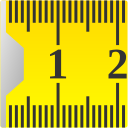

# Zollstock
Sailfish OS app to use your device as a ruler. 

You need to measure a length, but you don't have a ruler with you? 
Then use this app to get the job done.

>

## Translations
Available translations:

- English
- German
- Hungarian (Szabó G.)

If you missing your native language you are welcome to support this project with your translation.

[https://weblate.nubecula.org/engage/harbour-zollstock/](https://weblate.nubecula.org/engage/harbour-zollstock/)

## Planned Features
Feature request are welcome!

## Donations

If you like my work, you can buy me a beer! 

